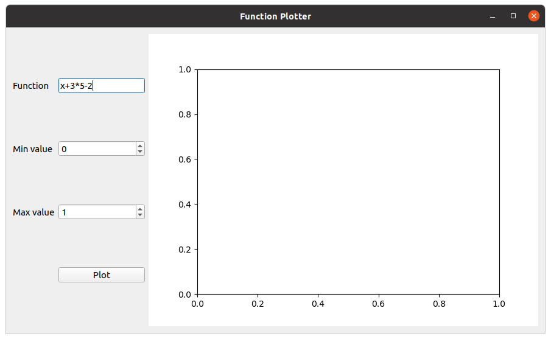

# Function-Plotter
A Pyside2 GUI application that is used to plot a function in a predefined range of values using matplotlib library.

## Getting started
### Prerequisites
- Python3
- Pyside2
- Matplotlib

### usage
please clone this repository first and run the following command   
`$ python3 main.py`  
a window will open like the follwing   
now, yu should enter the equation and min & max value and press the plot button    
the function figure should appear in the right side of the window or a dialoge box should popup if you made a mistake
